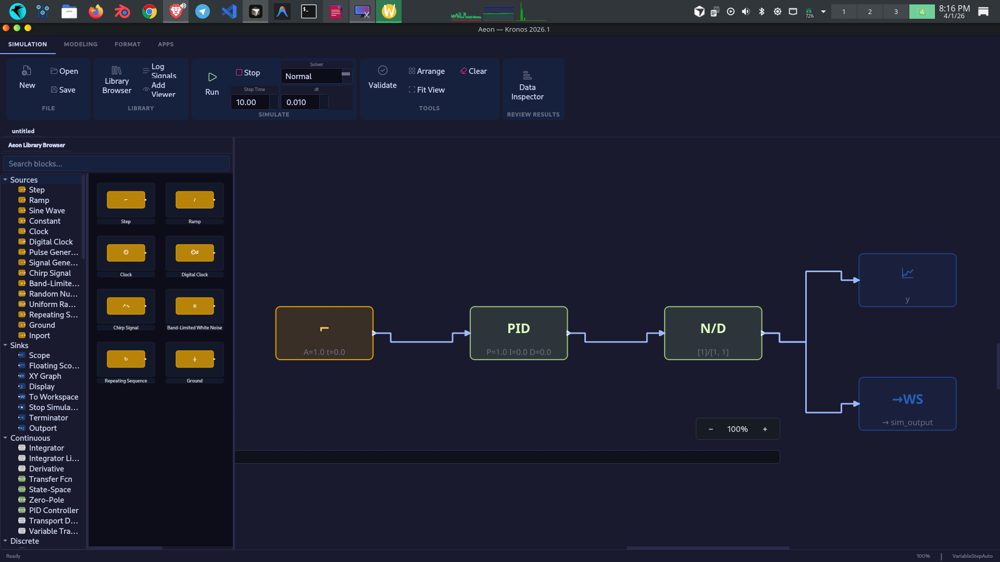

# Kronos IDE

Kronos is an open-source scientific IDE and simulation environment built as a Python-native alternative to MATLAB workflows.

It combines:
- a multi-tab code editor,
- an embedded command/kernel workflow,
- workspace and plotting panels,
- **Signal Analysis toolbox**,
- **Aeon visual simulation canvas**.

## Screenshots

### First Look


### Coding Workflow


### Signal Analysis Toolbox


### Aeon Visual Simulation Canvas


## Release Status (v1.0)

This branch is stabilized for public release:
- crash-prone UI paths in control-analysis dialogs were fixed,
- Aeon simulation thread shutdown is now safe when closing windows,
- incomplete ribbon actions are explicitly disabled with `Coming soon` tooltips instead of acting as silent no-ops.

## What Works

### Core IDE
- Multi-tab Python editing (`.py` files)
- Run code in integrated command workflow
- Workspace browser updates
- Plot capture/gallery integration
- Recent files and save/save-as support

### Signal Analysis Toolbox
- Import signals (`.wav`, `.csv`, `.txt`, `.npy`, `.mat`, `.ksa`)
- Time/spectrum/spectrogram/scalogram/persistence views
- Filtering (quick filters + filter designer)
- Measurements panel and CSV export
- Signal duplication, export, and script generation

### Aeon Visual Simulation Canvas
- Block library and drag/drop modeling
- Diagram validation and auto-arrange
- Simulation run/stop
- Scope outputs and runtime status
- Save/load `.sim` diagrams

## Tech Stack

- **Languages:** Python, C, C++
- **Desktop UI:** PyQt6
- **Numerics & science:** NumPy, SciPy, Matplotlib, SymPy
- **Control systems:** python-control (+ optional Slycot)
- **Graph/simulation infra:** NetworkX
- **Kernel/console integration:** IPython, ipykernel, jupyter_client, qtconsole
- **Native acceleration path:** CPython extensions (`kronos/native`, `kronos_cpp`)

## Installation

### Option A: Standard Python setup

```bash
python3 -m venv .venv
source .venv/bin/activate
pip install --upgrade pip
pip install -r requirements.txt
pip install -e .
```

### Option B: Project helper scripts

```bash
bash install.sh
bash verify.sh
```

## Run

```bash
source .venv/bin/activate
python -m kronos.main
```

Or, after editable install:

```bash
kronos
```

## Test

```bash
MPLCONFIGDIR=/tmp/matplotlib-kronos QT_QPA_PLATFORM=offscreen ./.venv/bin/python -m pytest -q tests
```

## Project Layout

```text
kronos/
  engine/                     # kernel bridge, routing, settings, workspace, plots
  ui/                         # main window, panels, dialogs, Aeon canvas, themes
  toolboxes/
    signal_analyzer/          # Signal Analysis toolbox
    Autonomous Driving Toolbox/  # experimental/secondary toolbox
  native/                     # CPython extension modules
kronos_cpp/                   # C/C++ extension sources
tests/                        # automated tests
```

## Roadmap

1. Expand currently disabled ribbon commands into full implementations (debug/live-editor/advanced plot tooling).
2. Deepen Signal Analysis UX (peak finder labeling workflow, normalized/two-sided spectrum modes).
3. Add richer Aeon debugging/inspection tools (step tracing, breakpoints, diagnostics overlays).
4. Ship cross-platform packaging and signed binaries.
5. Grow user-facing docs/tutorials and example projects.

## License

MIT
