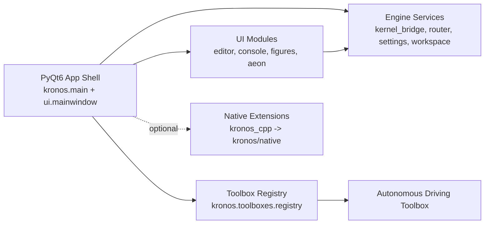

<p align="center">
  
</p>

<h1 align="center">Kronos IDE</h1>
<p align="center">
  Open-source, Python-native scientific simulation IDE.
</p>

<p align="center">
  
  
  
</p>

Kronos combines a Python code editor, an embedded IPython kernel, plotting workflows, block-diagram simulation (Aeon), and extensible engineering toolboxes in one desktop application.

## Why Kronos

- Integrated workflow: edit, run, inspect workspace, and visualize plots from one UI.
- Engineering-focused simulation: Aeon diagram modeling plus toolbox-based domain workflows.
- Extensible architecture: dynamic toolbox loading and optional native C++ acceleration.
- Practical defaults: persistent settings, runtime fallbacks, and environment verification script.

## Quick Start

### 1) Install (Linux helper)

```bash
bash install.sh
```

### 2) Launch

```bash
source .venv/bin/activate
python -m kronos.main
```

### 3) Verify environment

```bash
bash verify.sh
```

## Project Structure

```text
Kro/
  kronos/
    main.py
    engine/              # Kernel bridge, routing, settings, workspace, plot export
    ui/                  # Main window, panels, editor, Aeon canvas, dialogs, theme
    toolboxes/           # Dynamic toolbox registry + bundled toolboxes
    native/              # Python bridge for compiled native modules
  kronos_cpp/            # C++/Qt modules (pybind11 + CMake)
  tests/                 # Unit and smoke tests
  install.sh             # Full environment + build setup
  verify.sh              # Post-install checks
```

## Architecture



### Core Layers

- App shell: startup, splash, window composition, signal wiring.
- Engine layer: IPython execution bridge, message routing, workspace inspection, plot transfer.
- UI layer: editor, command window, Aeon canvas/simulator, themed widgets.
- Toolbox layer: runtime discovery/import of toolbox packages.
- Native bridge: optional pybind11 modules with Python fallbacks when unavailable.

## Toolboxes

Kronos discovers toolboxes from `kronos/toolboxes` and loads them dynamically.  
The repository currently includes `Autonomous Driving Toolbox` with:

- Bird's-eye 2D visualization,
- OpenGL 3D view,
- Sensors/perception panels,
- ADAS and planning simulation flow,
- HD map ingestion (OpenDRIVE and Lanelet2 in tests).

## Development Commands

Run tests:

```bash
source .venv/bin/activate
python -m unittest discover -s tests -v
```

Run smoke test:

```bash
source .venv/bin/activate
python kronos_smoke_test.py
```

## Runtime Notes (Linux)

If Qt display backend fails:

```bash
export QT_QPA_PLATFORM=xcb
python -m kronos.main
```

If OpenGL setup fails:

```bash
export LIBGL_ALWAYS_SOFTWARE=1
python -m kronos.main
```

## Git Hygiene

This repo includes a `.gitignore` for Python caches, virtualenvs, and build artifacts.  
If `__pycache__` / `.pyc` files were tracked before, untrack once:

```bash
git rm -r --cached -- ':(glob)**/__pycache__/**' ':(glob)**/*.pyc'
```
